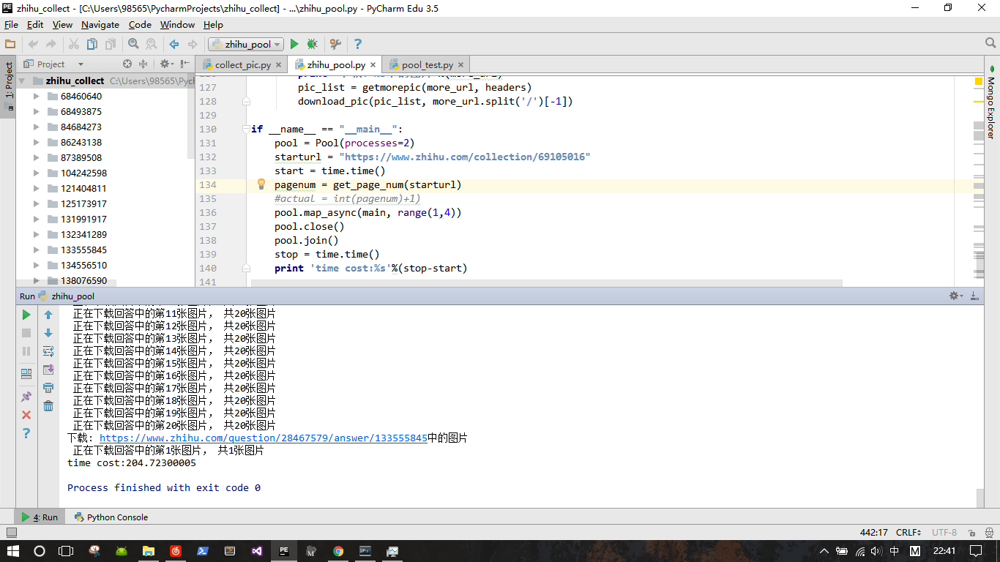

# zhihu_favorites_spider

###知乎收藏夹爬虫实现

####0x01 环境配置及说明

- python2.7 + windows10
- 8M带宽
- 开发环境：anaconda + pycharm Edu

#####使用到的模块

- requests
- BeautifulSoup
- multiprocessing
- functools

####0x02 代码说明

> collect_pic.py 顺序下载
> zhihu_pool.py 使用进程池加快下载速度

1. 没有使用cookie登录知乎， 只是更改了user-agent
2. 运行zhihu_py后会在代码所在的文件夹进行下载，文件夹的名字是问题下的回答的编号
3. 可能会遇到图已经删除的情况，代码会删除没有图片存在的文件夹
4. 由于使用了线程池，网络带宽会被大量的占用
5. 有的收藏夹有几十页，全部下载下来会有两个多G，花费时间在半个小时左右
6. 如果想要调试代码，最好还是将range(1, int(pagenum)+1)改成如下形式，只下载两个页面
节省调试的时间。
7. 已经在代码中加入了文件是否存在的检查，再次下载时不会重复下载文件
8. 代码中肯定会有不足，请fork项目修改后提交，共同进步
```
pool.map_async(func, range(1,3))
```


####0x03 结果和todo




####todo
- 使用代理IP防止更高速度下载时被知乎封掉IP
- 使用Scrapy重构代码


####0x04 ~~福利~~知乎收藏夹

[轮带逛系列](https://www.zhihu.com/collection/108788130)

[知乎花式骗图](https://www.zhihu.com/collection/69105016)

[轮子哥带我逛知乎](https://www.zhihu.com/collection/78172986)

[知乎看片指日可待](https://www.zhihu.com/collection/112174987)

[知乎看片，就在今日](https://www.zhihu.com/collection/46627456)


